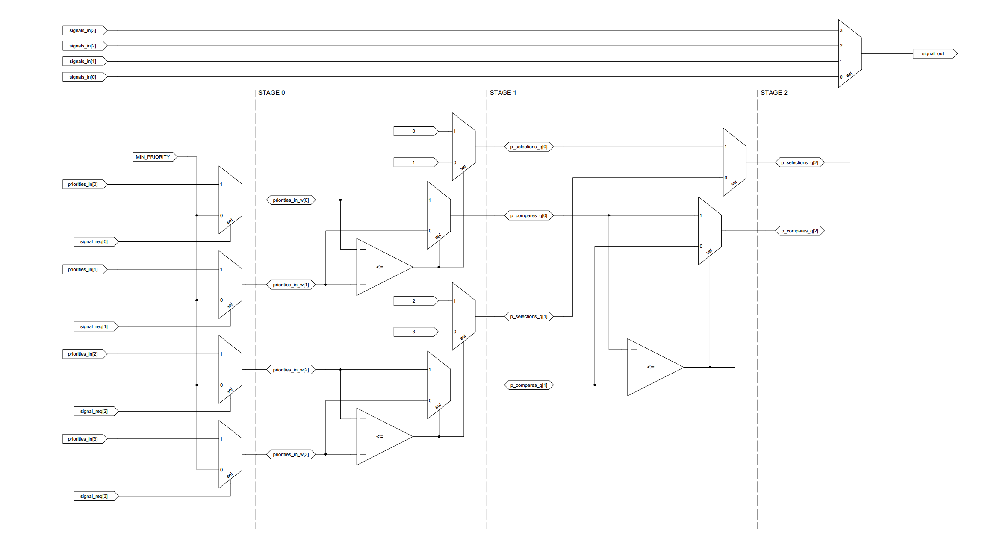

# Priority Multiplexer (priority_mux) Module

The `priority_mux` module is a Verilog implementation designed to select signals based on priority levels. It handles multiple signals and uses a priority-based mechanism to choose the signal with the highest priority that is also requesting service.

 *An example of the logic that is generated for a 4x1 priority multiplexer.*

## Features

- **Dynamic Signal Widths**: Configurable signal and priority widths.
- **Multi-Stage Comparison**: Uses a generate block to compare priorities across multiple stages.
- **State Machine Control**: Manages signal selection through a state machine, ensuring robust operation.

## Parameters

- `N_PRIORITY_WIDTH`: The width of the priority signals. Default is 2 bits.
- `N_SIGNAL_WIDTH`: The width of the data signals. Default is 8 bits.
- `N_SIGNALS`: The number of signals to manage. Default is 4.

## Ports

- `clk`: Clock input.
- `rst`: Reset input, active low.
- `priorities_in`: Input vector for all priorities, size `[N_PRIORITY_WIDTH * N_SIGNALS - 1:0]`.
- `signals_in`: Input vector for all signals, size `[N_SIGNAL_WIDTH * N_SIGNALS - 1:0]`.
- `signal_out`: Output for the selected signal, size `[N_SIGNAL_WIDTH - 1:0]`.
- `signal_req`: Request input indicating which signals are requesting to be selected, size `[N_SIGNALS - 1:0]`.
- `signal_ack`: Acknowledgment output for the selected signal, size `[N_SIGNALS - 1:0]`.
- `busy`: Indicates if the module is currently processing.

## Functionality

1. **Initialization**: On reset, all internal registers and outputs are set to their initial states.
2. **Priority Comparison**: Uses a generate block to dynamically compare the priorities of the signals in a multi-stage process.
3. **Selection**: The signal with the highest priority that is requesting service is selected and passed to the output.
4. **State Management**: A state machine controls the module's operation through `STATE_IDLE`, `STATE_WAIT`, and `STATE_DONE`.

## Example Usage

To use the `priority_mux` module, instantiate it in your Verilog design and connect the inputs and outputs as needed:

```verilog
priority_mux #(
    .N_PRIORITY_WIDTH(2),
    .N_SIGNAL_WIDTH(8),
    .N_SIGNALS(4)
) my_priority_mux (
    .clk(clk),
    .rst(rst),
    .priorities_in(priorities),
    .signals_in(signals),
    .signal_out(selected_signal),
    .signal_req(requests),
    .signal_ack(acknowledgments),
    .busy(busy_signal)
);
```

Ensure that the clk and rst are properly managed and that `priorities_in`, `signals_in`, and `signal_req` are set according to your application requirements.

## Simulation and Testing
For simulation, create a testbench that stimulates the priority_mux inputs (priorities_in, signals_in, signal_req) and observes the outputs (signal_out, signal_ack, busy) to verify the module's functionality. See example test bench, [priority_mux_tb.sv](./priority_mux_tb.sv).